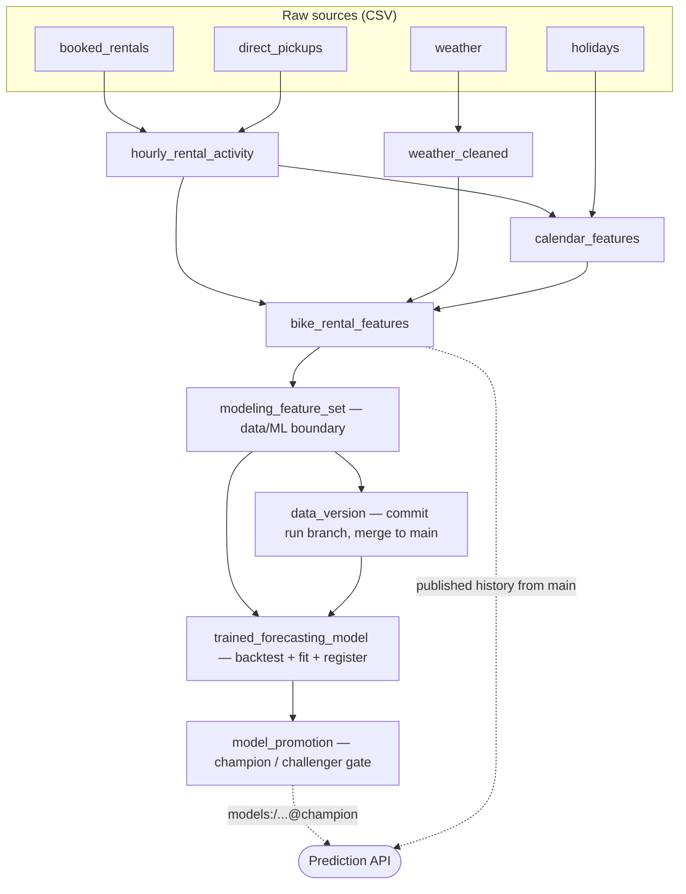

# Bike Rental Demand Forecasting — End-to-End MLOps System

A production-style machine learning system that forecasts **day-ahead hourly bike rental demand** for a city-wide bike-sharing service. It covers the full lifecycle: ingesting raw operational data, engineering features, training and honestly evaluating forecasting models, versioning both data and models, automatically promoting the best one, and serving predictions over an HTTP API — all reproducible and traceable end to end.

Built as part of the appliedAI ML & MLOps track, then extended well past the assignment into a system that mirrors how an ML team actually operates.

---

## The problem

A bike-sharing company must decide **how many bikes to position across the city each day**. That decision is made one day in advance, so the distribution team needs a **forecast of hourly demand for the next 24 hours**. Under- or over-supplying both cost money: empty docks mean lost rentals, full docks mean idle inventory.

The horizon is deliberately scoped to the next day only — the 24 hours immediately following the most recent observed data — because that is exactly what the team's planning cycle consumes. Everything in the system is built around producing and trusting that one forecast.

---

## What this project demonstrates

This is the short version of "why it's worth a look." Each point is explained in **How it works** below.

- **Honest time-series evaluation.** The model is evaluated with **walk-forward backtesting** (expanding-window cross-validation), which reports performance as a *distribution over time* (`mean_r2`, `std_r2`) rather than a single optimistic number.
- **No training–serving skew.** The features served at inference are produced by the *exact same code* used in training, so the two can't silently drift apart — the most common and most dangerous bug in applied ML.
- **Full reproducibility / lineage.** Every registered model links back to the MLflow run, the git commit, and the **LakeFS data commit** that produced it. "Which data and code made this model?" has a concrete, queryable answer.
- **Automated, safe deployment.** A **champion/challenger** gate promotes a new model only if it beats the incumbent; production always loads `@champion` by alias, so deploying is an alias move plus a reload — never a code change.
- **Config-driven, discoverable design.** Model choice and hyperparameters are typed configuration surfaced in the Dagster UI, not magic numbers buried in code.

---

## System architecture

The pipeline is a Dagster asset graph. Each node is a versioned, observable asset:



The boundary between data and ML is explicit: everything up to `modeling_feature_set` is data engineering; `trained_forecasting_model` and `model_promotion` are the ML layer. The API is a separate service that consumes the registry and the published data.

---

## Reproducibility & lineage
 
```
registered model version
   └─ MLflow run (params, metrics, signature)
        ├─ git commit        (the code)
        └─ LakeFS commit     (the exact Parquet snapshot of every data asset)
```
 
Every training run is tagged with its `lakefs_commit` and git SHA; the data-versioning step commits the run's branch and merges it to `main` only after all data assets succeed; the API surfaces the served `model_version` and `data_commit` on `/health` and every forecast. Given any prediction, you can walk all the way back to the data and code that produced it.
 
---

## How it works

### 1. Data pipeline (Dagster)

Raw rentals arrive as individual events in two tables (advance bookings and on-the-spot pickups). The pipeline aggregates them into a **continuous hourly demand timeline**, filling gaps so that hours with zero activity are still represented rather than missing. Weather observations are cleaned (implausible "feels-like" temperatures corrected, zero-humidity readings imputed) and joined on the hour; a holiday calendar and derived calendar fields (hour, weekday, month, weekend/holiday flags) are layered on.

Responsibilities are kept separate the way a maintainable pipeline should: **assets** declare *what* is produced and how things depend on each other, pure **transformation functions** hold the *logic* (and are unit-tested in isolation), **resources** own external connections (file system, MLflow, LakeFS), and an **IO manager** owns persistence. Source schemas are guarded by **asset checks** so a malformed input fails fast with a clear message instead of corrupting everything downstream.

### 2. Feature engineering

Three families of features drive the forecast. **Cyclical encodings** (sine/cosine of hour and month) let the model treat 23:00 and 00:00 as adjacent rather than maximally distant. **Lag features** (24-hour and 168-hour) give it yesterday's and last-week's demand at the same hour. **Context-aware historical aggregates** — the average demand for the same hour over recent days, and for the same weekday-and-hour over recent weeks — turned out to be the single strongest signal.

All of these are *backward-looking by construction* (each row only sees data strictly before it), which is what makes the later backtest honest. Critically, this exact assembly lives in **one shared function** used by both the training pipeline and the serving API, so the features can never diverge between the two.

### 3. Training and evaluation

Model selection is **config-driven**: a typed `TrainingConfigResource` exposes the model type and each model's hyperparameters as discoverable fields in the Dagster launchpad, so an experiment is a config change, not a code edit. Five candidates are supported (XGBoost, LightGBM, Random Forest, Linear Regression in a scaling pipeline, and a mean baseline).

Evaluation uses **walk-forward backtesting** via expanding-window splits: the model is repeatedly trained on the past and scored on the next unseen window. This produces a metric *per fold*, and the run reports both the mean (headline performance) and the standard deviation (stability over time — something a single holdout can't show). The deployed artifact is then fit on *all* available history; the backtest, not a held-out slice, is its performance estimate. Both steps happen inside a single tracked run so the registered model and its evidence are inseparable.

### 4. Experiment tracking and model registry (MLflow)

Every training run logs its parameters, per-fold and aggregate metrics, the model **signature** (input/output schema), an input example, and provenance tags. The fitted model is registered as a new **version** of `bike_rental_forecaster`. A dedicated `MlflowResource` owns the connection and run lifecycle — including marking a run FAILED if training raises — while assets decide *what* to log. The tracking URI is injected via environment variable and fails loudly if missing, so misconfiguration surfaces at launch rather than silently writing to the wrong place.

### 5. Automated promotion (champion/challenger)

A new version doesn't become production automatically. The `model_promotion` asset compares it against the current `@champion` on `mean_r2` and moves the `@champion` alias only if the new version improves by more than a configurable margin; otherwise it's recorded as `@challenger`. The very first run bootstraps the champion. The decision policy (metric, direction, minimum improvement) is itself run configuration. Because production loads strictly by alias (`models:/bike_rental_forecaster@champion`), there are never hardcoded version numbers anywhere.

### 6. Data versioning and lineage (LakeFS)

LakeFS brings Git-style versioning to the data. Each pipeline run writes its Parquet assets to a **per-run branch** created as a zero-copy snapshot of `main`. Only after all data assets succeed does the `data_version` asset **commit** that branch and **merge it to `main`** — so `main` only ever advances to a complete, consistent dataset, never a half-updated one. The branch is a transaction boundary, not a long-lived line of development: write freely, commit to seal, merge to publish.

This design also makes **partial re-runs cheap**: retraining alone reads the last published snapshot from `main` through a fresh branch, with no need to re-run upstream data assets. Every training run is tagged with its `lakefs_commit`, closing the lineage chain shown above.

### 7. Serving (FastAPI)

The API loads the `@champion` model from the registry **by alias** at startup, so promoting a new model is an alias move plus a `/reload` — no redeploy. It reads the model's feature columns straight off the logged **signature** rather than hardcoding them, computes the forecast horizon's features with the same shared assembly code used in training (eliminating skew), and derives the backward-looking lag features from history published to LakeFS `main`. Requests are validated with Pydantic (exactly 24 hours, known weather conditions, range-checked values). Every response carries the served `model_version` and `data_commit`, surfacing the full lineage right at the prediction.

---

## Results

On a chronologically held-out evaluation, feature engineering mattered more than model complexity — a well-featured linear model already explained ~86% of variance, and gradient boosting pushed it further:

| Model | MAE | RMSE | R² |
|---|---|---|---|
| Dummy (mean) | 174.98 | 232.61 | −0.11 |
| Linear Regression (baseline) | 134.30 | 199.58 | 0.18 |
| Linear Regression (engineered features) | 50.74 | 82.74 | 0.86 |
| Random Forest | 44.92 | 72.28 | 0.89 |
| **XGBoost** | **40.17** | **62.88** | **0.92** |

Under the later **walk-forward backtest**, steady-state performance (including the cold-start first fold, which has the least history) is **~0.85** — a more honest, time-aware picture than any single split. The strongest predictors are the context-aware historical demand aggregates, confirming that *recent demand at similar times* is what drives the forecast.

**The strongest finding:** context-aware historical-demand features (same-weekday-hour and same-hour averages, daily/weekly lags) dominate the predictive signal — feature engineering contributed more than model choice. Weather is useful but secondary.

---

## Tech stack

**Core ML:** Python 3.11 · pandas · scikit-learn · XGBoost · LightGBM

**Orchestration & MLOps:** Dagster · MLflow (tracking + registry) · LakeFS (data versioning) · Docker

**Serving:** FastAPI · Uvicorn · Pydantic

**Tooling:** uv · Ruff · Pytest · Jupyter

---

## Quick start

### Prerequisites
- Python 3.11, [uv](https://docs.astral.sh/uv/), make, git, Docker (for LakeFS)
- macOS only: `brew install libomp` (required by XGBoost/LightGBM)

### Install and configure
```bash
make install
cp .env.example .env   # local-dev defaults work out of the box
```

### Run (three services, in order)
```bash
# 1. LakeFS — data versioning
make infra        # starts LakeFS in Docker (UI at http://localhost:8000)
make lakefs-repo  # create the repository (run once)

# 2. MLflow — tracking + registry (separate terminal; UI at http://127.0.0.1:5000)
make mlflow

# 3. Dagster — the pipeline (separate terminal; UI at http://127.0.0.1:3000)
make dev
```
Materialize the asset graph in the Dagster UI to run the pipeline end to end and promote a model.

```bash
# 4. Prediction API (separate terminal, once a champion exists)
make api
make predict   # example day-ahead forecast
```

### Other commands
```bash
make test    # run the test suite
make lint    # check formatting + lint (Ruff)
make format  # auto-fix
make infra-down  # stop LakeFS
```

---

## Project structure

```text
scripts/
src/bike_rental/
├── api/                 # FastAPI prediction service (schemas, model loading, feature builder)
└── defs/
    ├── assets/          # Dagster assets: sources, preprocessing, training, promotion, data_version
    ├── asset_checks/    # source-schema and data-quality checks
    ├── io_managers/     # LakeFS-backed Parquet IO manager
    ├── preprocessing/   # pure, tested transformation functions + shared feature assembly
    ├── resources/       # data loader, MLflow, LakeFS, training config
    ├── training/        # model factory, metrics, walk-forward backtest, training core
    └── utils/           # metadata + git provenance helpers
tests/                   # unit tests for transforms, training core, promotion gate, API features
reports/                 # weekly engineering write-ups
docker-compose.yml · Makefile · .env.example · pyproject.toml
```

---

## How the project evolved

The system was built in stages, each a deliberate step toward production-readiness:

1. **Data pipeline** — reusable Dagster preprocessing from raw CSVs to a clean feature dataset.
2. **Modeling** — EDA, a baseline ladder (Dummy → Linear → RF → XGBoost), feature engineering, model comparison.
3. **Production refactor** — config-driven model selection, Parquet persistence, the split moved in-process.
4. **MLflow** — experiment tracking and a versioned model registry.
5. **Walk-forward backtesting** — replaced single-holdout evaluation with honest time-series cross-validation.
6. **Champion/challenger** — automated, gated promotion by registry alias.
7. **LakeFS** — data versioning, atomic per-run publishing, and the full lineage chain.
8. **Prediction API** — alias-based serving with zero training–serving skew.
9. **Hardening** — shared feature assembly, extracted/tested training core, promotion-gate tests, documentation.

Detailed week-by-week write-ups are in [`reports/`](reports/).

---

## Possible next steps

- A file-arrival sensor to retrain automatically when new source data lands.
- Input-drift and performance-decay monitoring on the served model.
- A cloud object-store backend for LakeFS (an S3/GCS namespace swap, no code change).